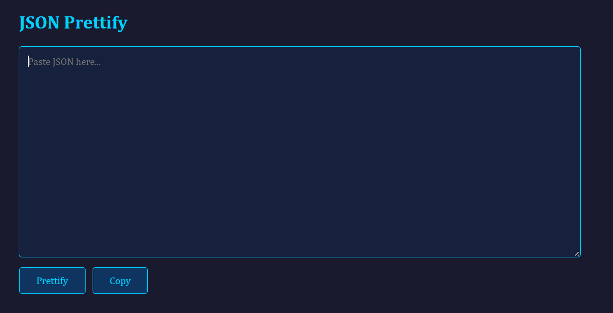

# JSON Prettifier

A local JSON prettifier that runs entirely on your machine. Paste in ugly or minified JSON, hit Prettify, and get cleanly indented output right in the textarea — ready to copy.

If you've gotten used to pasting JSON into web-based prettifiers, this gives you the same workflow without sending your data to someone else's server. Everything stays on localhost.



## What It Does

- Parses and pretty-prints JSON with 2-space indentation
- Writes the result back into the textarea for easy copying
- Shows parse errors with line number, column, and message if your JSON is malformed
- One-click copy to clipboard

## Requirements

- Python 3
- Flask (`pip install flask`)
- A browser

## Usage

```bash
pip install flask
python app.py
```

Then open `http://127.0.0.1:5000` in your browser.

If you're running behind nginx, add a proxy block:

```nginx
location /jsonlint/ {
    proxy_pass http://127.0.0.1:5000/;
    proxy_set_header Host $host;
    proxy_set_header X-Real-IP $remote_addr;
}
```

Then access it at `https://yourdomain/jsonlint/`.

## How It Works

Flask serves a single HTML page. When you click Prettify, the browser posts your raw text to a local endpoint. Python's `json.loads()` validates it, `json.dumps(indent=2)` formats it, and the result is written back into the textarea. On parse failure, the error appears below the buttons instead. No data leaves your machine.

